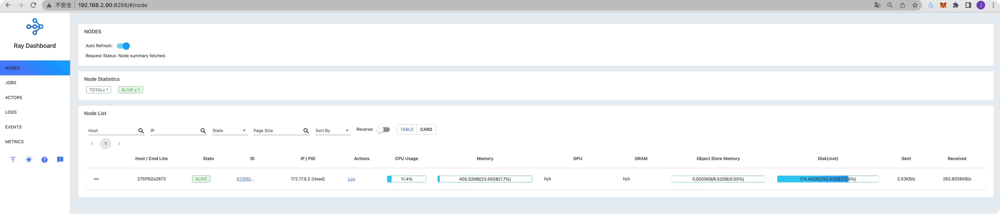
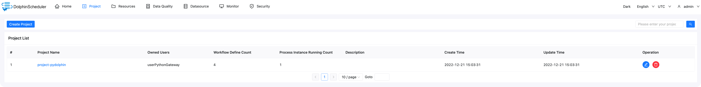
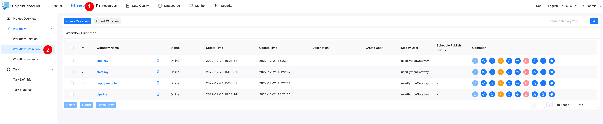
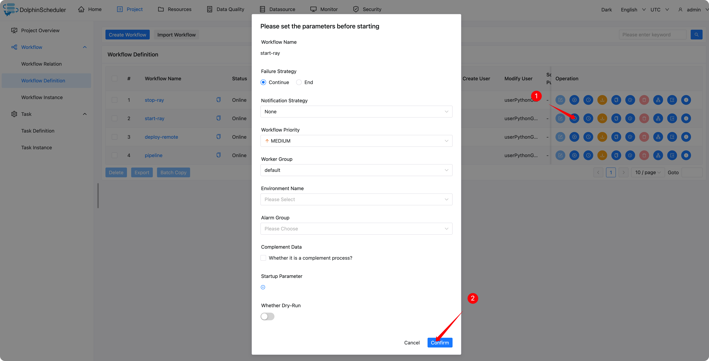
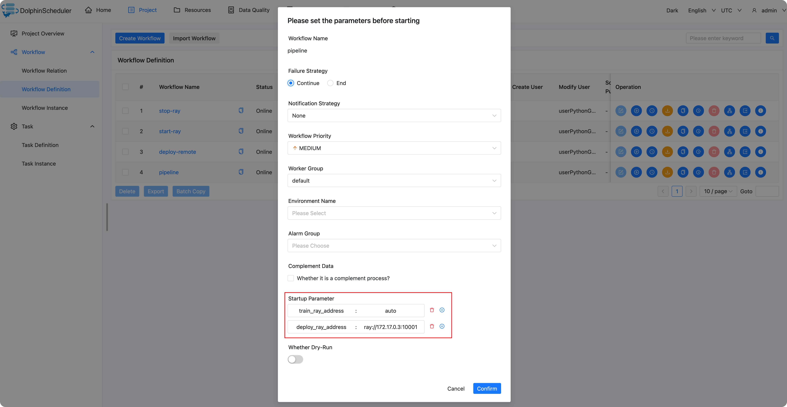
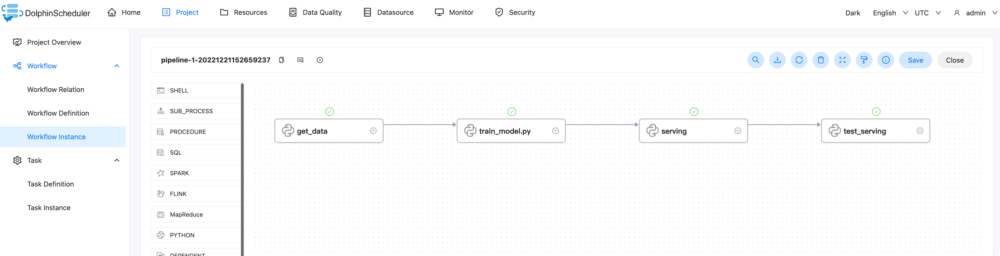
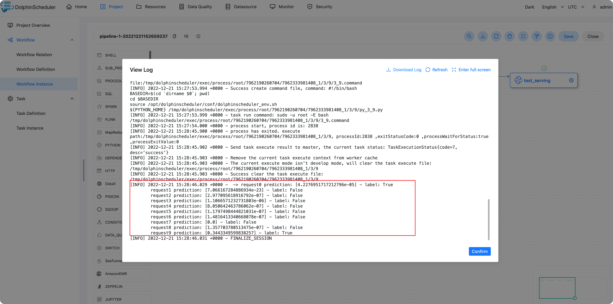

# dolphinscheduler-ray-example


## Start DolphinScheduler

We start the Dolphinscheduler with the following command.

The following ports are used for:

- 12345: DolphinScheduler UI
- 25333: pydolphinscheduler SDK to submit the workflow
- 8265: the tray (for training) dash board 

```shell
docker run --name dolphinscheduler-standalone-server -p 12345:12345 -p 25333:25333 -p 8265:8265 -d jalonzjg/dolphinscheduler-standalone-server:3.1.2-ray
```

And then, we can log in to the DolphinScheduler at `http://<ip>:12345/dolphinscheduler/ui`

- user: `admin`

- password: `dolphinscheduler123`


## Start ray cluster to deploy the model

For convenience, I reuse the ds image, but only to start the ray service.

```shell
docker run --name ray -p 8266:8265 -p 10001:10001 -d jalonzjg/dolphinscheduler-standalone-server:3.1.2-ray ray start --num-cpus=8 --object-store-memory=7000000000 --head --block --dashboard-host=0.0.0.0
```

Then, we can login to the ray (for model deployment) dashboard` <ip>:8266`

we can use command `docker inspect -f '{{range .NetworkSettings.Networks}}{{.IPAddress}}{{end}}' ray` to get the ip




## Create workflow

```shell
export PYDS_HOME=./
python pyds-workflow.py
```

After we log in to the DolphinScheduler, we can see a project




Then, we can see 4 workflow in the project

- start-ray: start a ray cluster in the docker
- stop-ray: stop the ray cluster
- deploy-remote: deploy the model to the remote ray cluster
- pipeline: train the model in the local ray cluster and deploy the model to the remote ray cluster




### start ray



Then, we can log in to the ray (for model training) dashboard` <ip>:8265`


### Run Pipeline





**Startup Parameter:**

- train_ray_address: ray cluster address of the training model
- deploy_ray_address: `ray://<ip>:10001`, The address of the ray cluster where the model is deployed


Then we can seed the workflow instance of `pipeline`, there are for tasks:

- get_data: download data, or you can do something like etl task
- train_model: training model
- serving: deploy model
- test_serving: test the model serving




we can double click the test_serving task and click the view log to view the task log. Log as follows.


