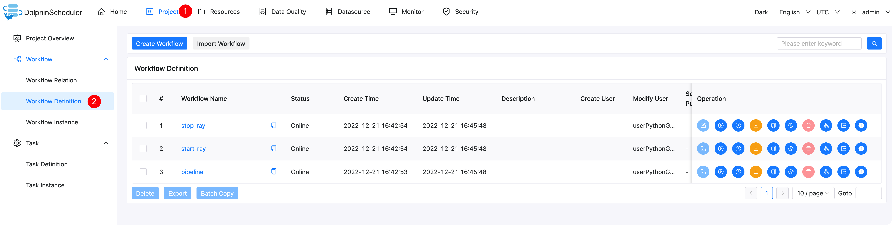
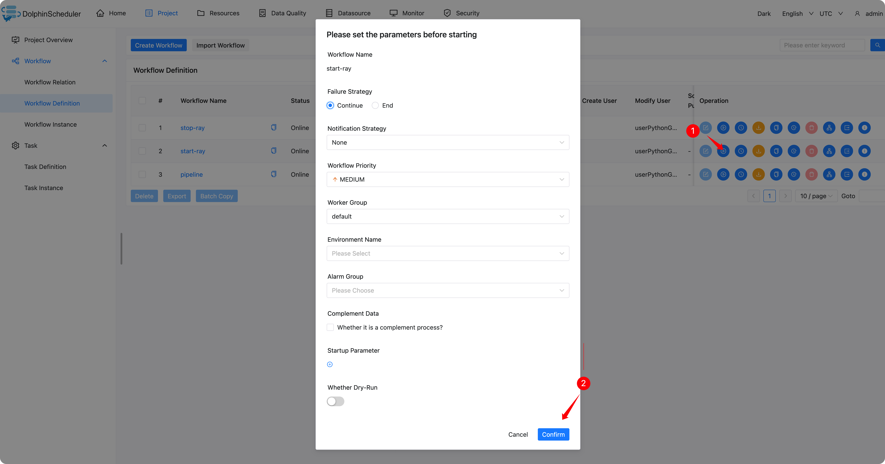
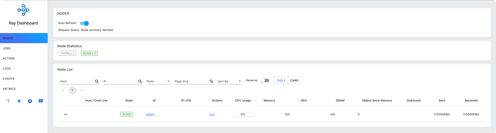
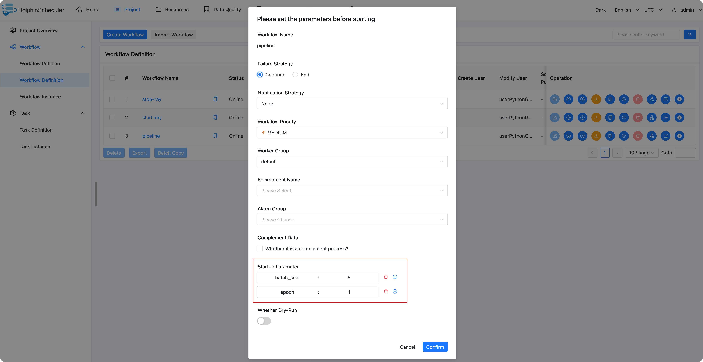
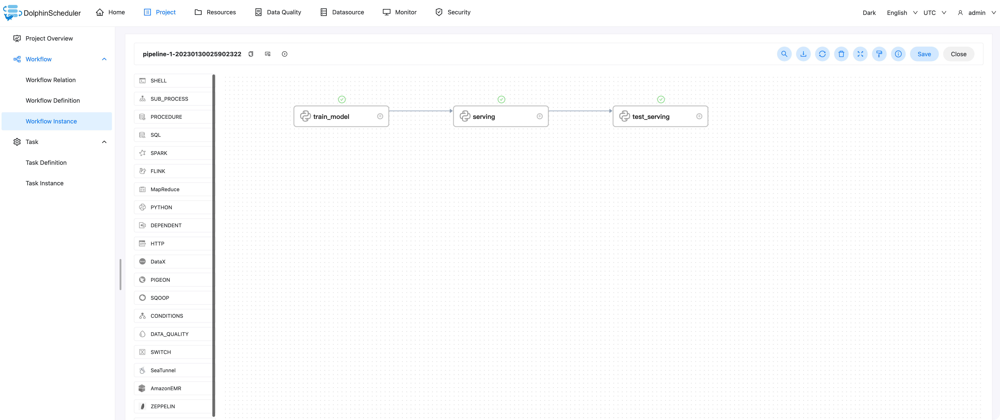

# dolphinscheduler-ray-example


In this example, we can build a reusable machine-learning workflow using [DolphinScheduler](https://dolphinscheduler.apache.org/#/en-us) and [Ray AIR](https://docs.ray.io/en/latest/ray-air/getting-started.html).

Demo from [Tabular data training and serving with Keras and Ray AIR](https://docs.ray.io/en/latest/ray-air/examples/tfx_tabular_train_to_serve.html)


## Start DolphinScheduler

We start the Dolphinscheduler with the following command.

The following ports are used:

- 12345: DolphinScheduler UI
- 25333: pydolphinscheduler SDK to submit the workflow
- 8265: the tray (for training) dashboard 

```shell
docker run --name dolphinscheduler-standalone-server -p 12345:12345 -p 25333:25333 -p 8265:8265 -d jalonzjg/dolphinscheduler-standalone-server:3.1.2-ray
```

And then, we can log in to the DolphinScheduler at `http://<ip>:12345/dolphinscheduler/ui`

- user: `admin`

- password: `dolphinscheduler123`


## Create workflow

```shell
python3 -m pip install apache-dolphinscheduler==4.0.0
export PYDS_HOME=./
python3 pyds-workflow.py
```

After we login to the DolphinScheduler, we can see a project


Then, we can see 3 workflows in the project

- start-ray: start a ray cluster in the docker
- stop-ray: stop the ray cluster
- pipeline: train the model in the local ray cluster and deploy the model




### start ray



Then, we can log in to the ray (for model training) dashboard` <ip>:8265`



### Run Pipeline




**Startup Parameter:**

- batch_size
- epoch


Then we can seed the workflow instance of `pipeline`, there are for tasks:

- train_model: train model
- serving: deploy the model
- test_serving: test the model serving




We can double-click the test_serving task and click the view log to view the task log. Log as follows.


